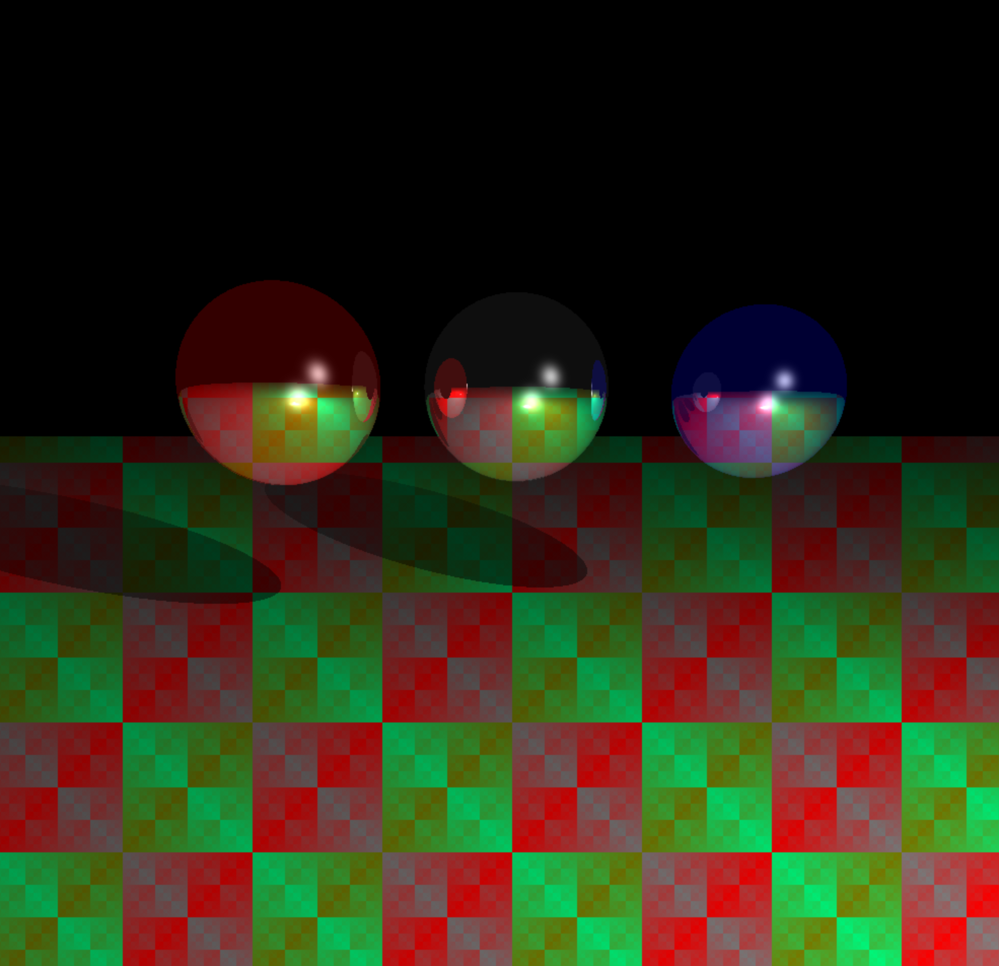
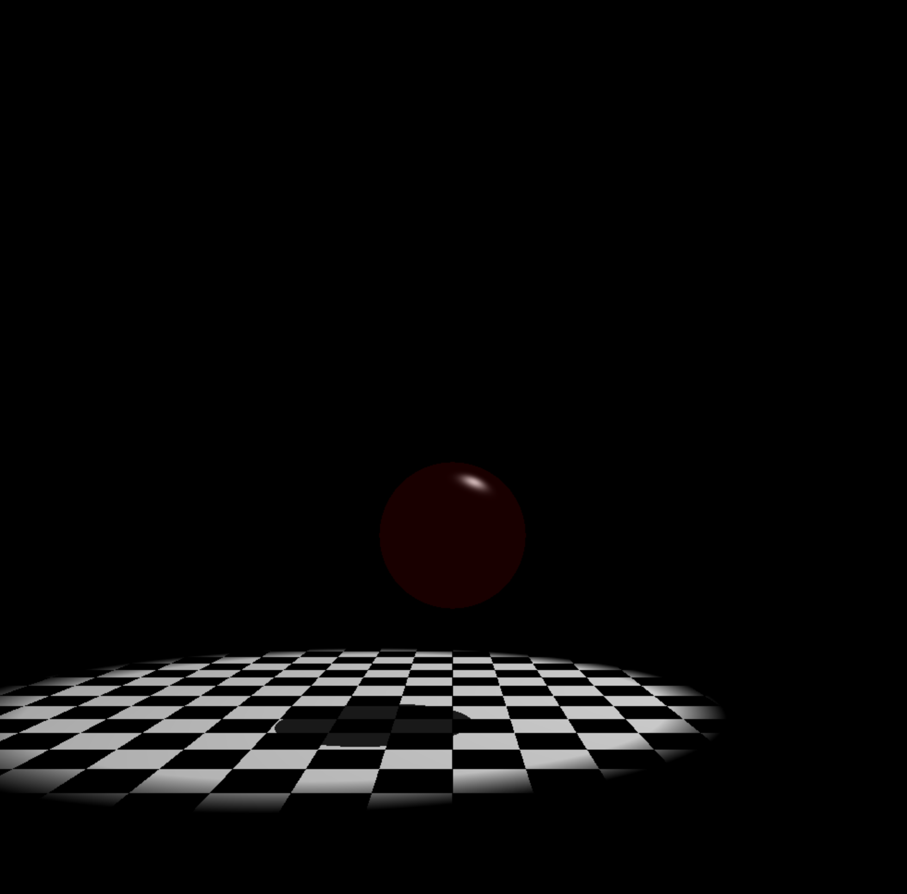
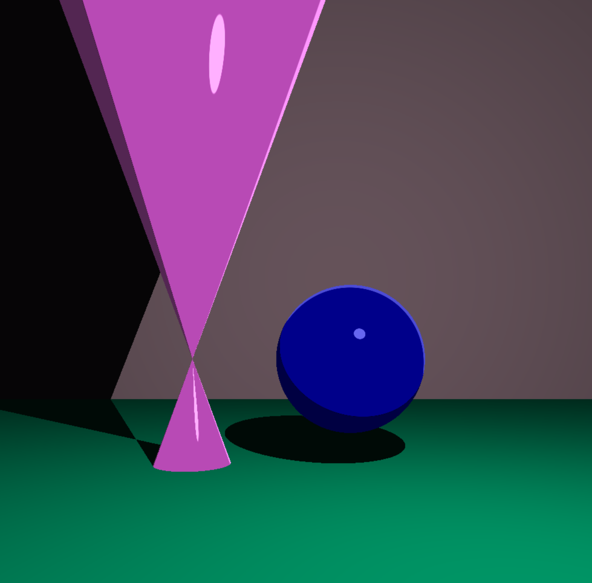
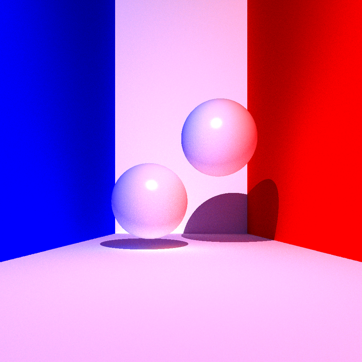
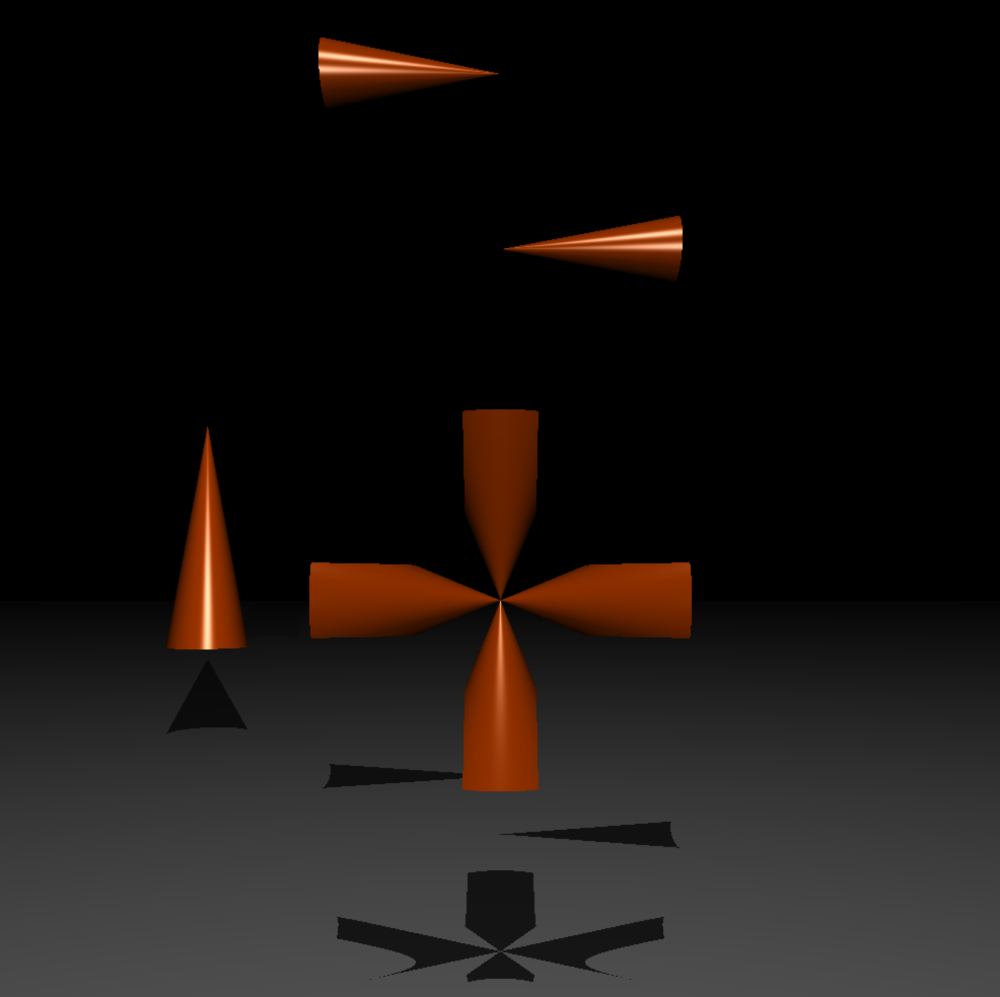
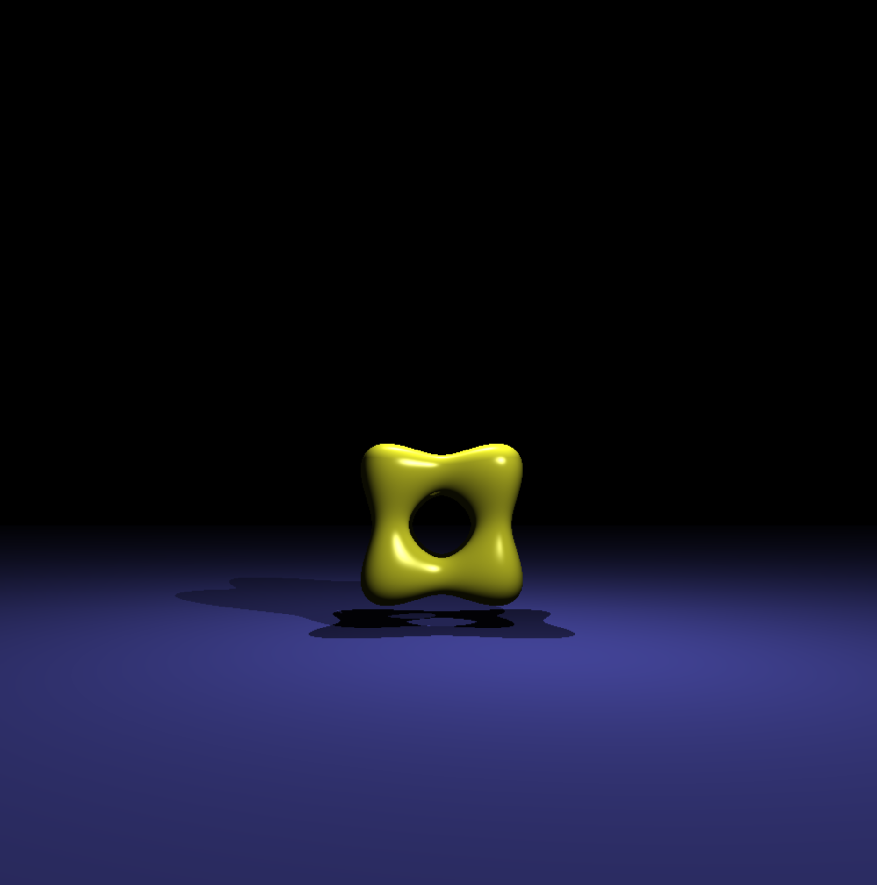
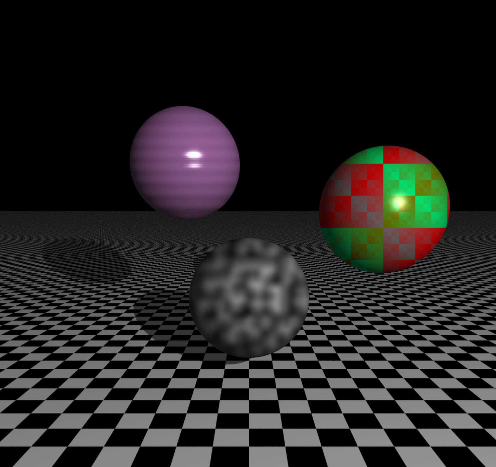
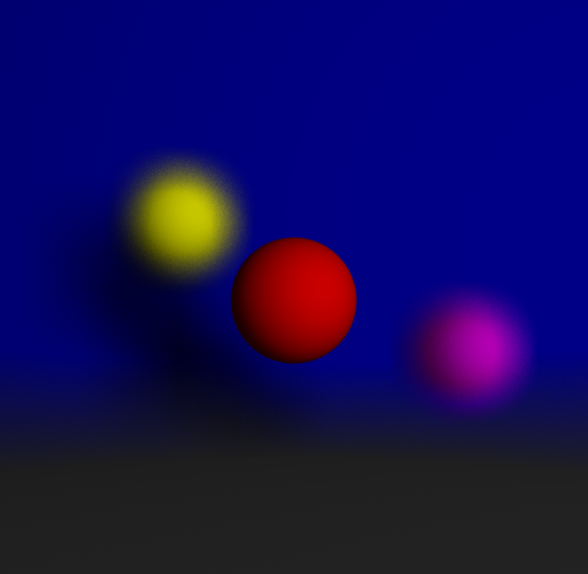
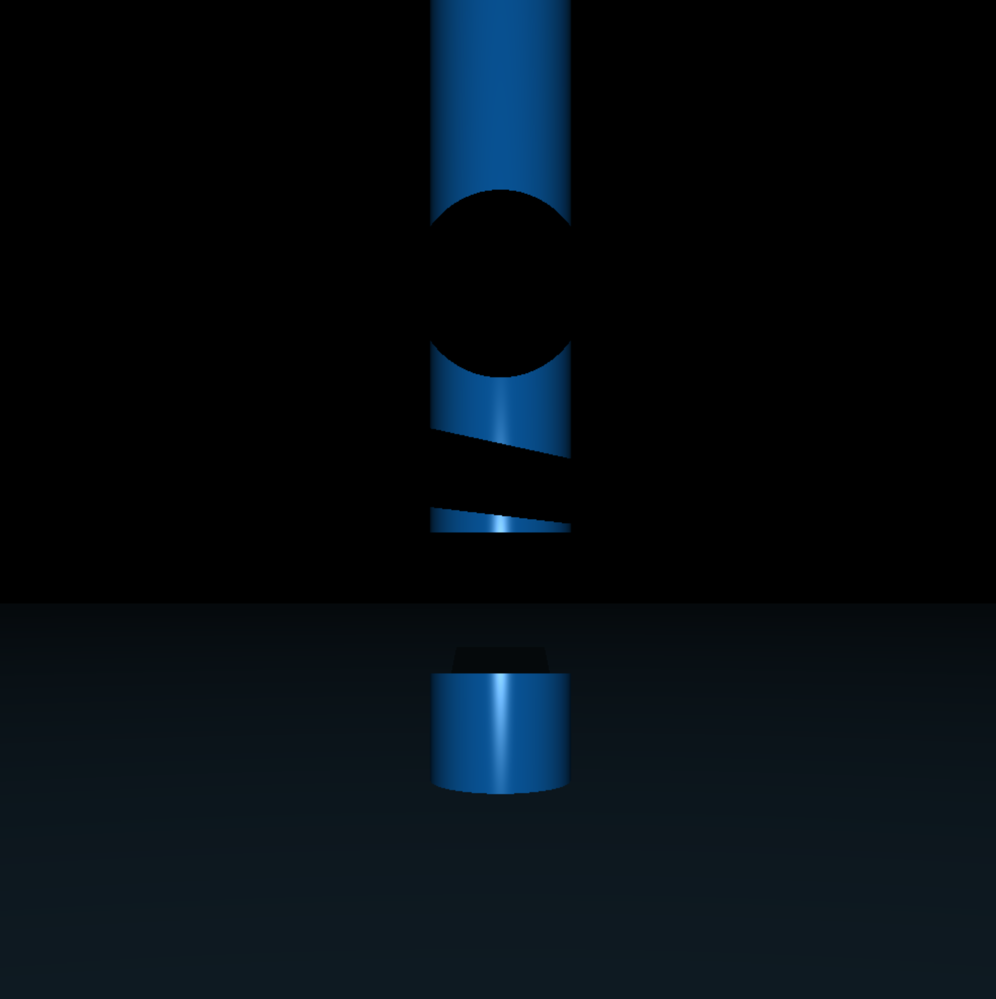
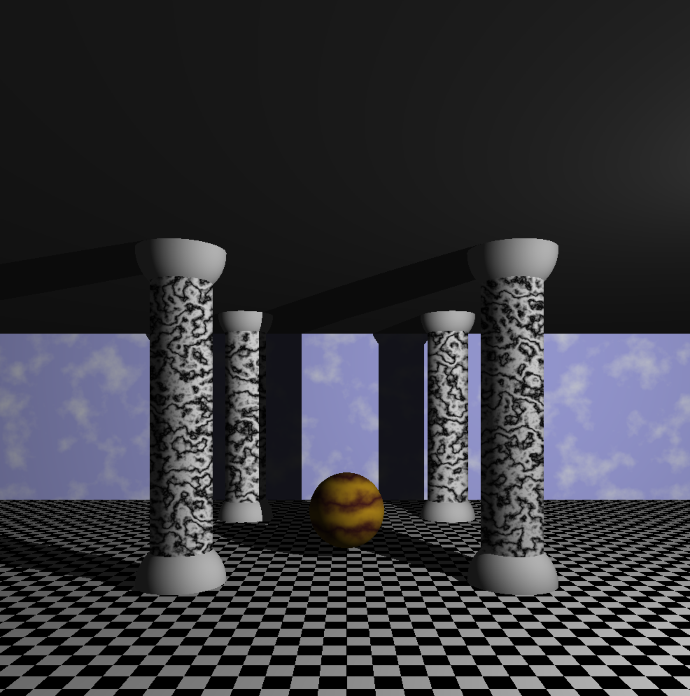

# RT-42

Note: this project was made for MacOS.

## Installation:

```
git clone https://github.com/cel-oiri/RT-42.git
cd ./RT-42
make
```
## Usage

```
./rt [file_path]
```
- filename must contain path to a valid scene. If the scene is not valid, RTv1 will write corresponding error on standard output.
- if you want to test your own scene check the ```parse.h``` in repository 'Includes' to have an idea how to write a valid scene.

## Screenshots














## Ressources

soon..

## Contact me

Feel free to email me (eloiriaglichaimae2@gmail.com) about any bugs or anything you find wrong in the code.
